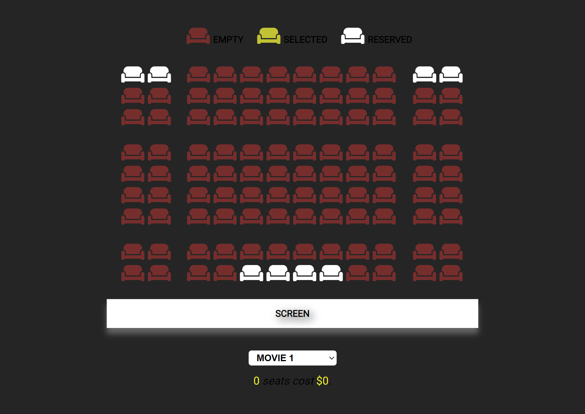
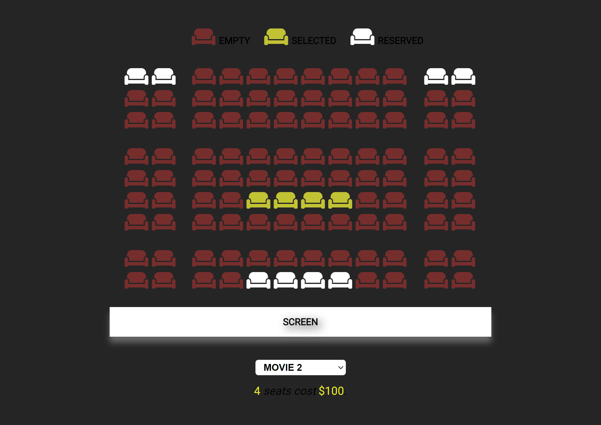

# Book your seat in our theatre for the film you want to watch before it's too late!

## The App

In this project, I used "**click**" and "**change**" event listeners to change the general view of the application (seat information, number of seats selected and the amount to be paid) depending on user interaction.

I saved the changes made by the user on the page (seat and film selection) in the **local storage**, and in case the user refreshes the page or disconnects, I enabled the user to continue from where he/she left off by referring to the data in the **local storage**.

### Selected Seats

For the film you want to watch, you can see:

- which of the seats in the theatre you have chosen,
- how many seats you have chosen,
- how much you have to pay according to the choices you have made.

